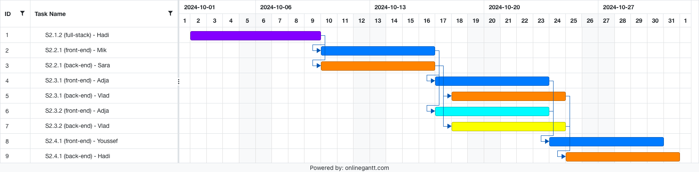

# Sprint 2 Plan of Action

**Author:** Hadi Assemani   
**Date:** 2 Oct 2024

## Task Ids
- **S2.1.2:** 
    **User Authentication & Team Management** → Functionality for instructors to create teams and assign students to specific groups.
- **S2.2.1:** **Basic Peer Assessment Interface** → Design and develop simple interfaces where students can select teammates for
evaluation.
- **S2.3.1:** **Basic Evaluation and Submission** → Enable students to provide peer ratings using a 5-point scale for the Cooperation
dimension.
- **S2.3.2:** **Basic Evaluation and Submission** → Confirm submission of peer assessment.
- **S2.4.1:** **Dimension-Based Assessment** → Add the remaining assessment dimensions: Conceptual Contribution, Practical
Contribution, and Work Ethic.

 

---

| Task ID | front-end/back-end | Assignee | Due Date |
| --- | :--: | :--: | :--: |
| S2.1.2 | full-stack | Hadi | Oct 9th |
| S2.2.1 | front-end | Mik | Oct 16th |
| S2.2.1 | back-end | Sara | Oct 16th |
| S2.3.1 & S2.3.2 | front-end | Adja | Oct 23rd |
| S2.3.1 & S2.3.2 | back-end | Vlad | Oct 24th |
| S2.4.1 | front-end | Youssef | Oct 30th |
| S2.4.1 | back-end | Vlad | Oct 31st |

---

 

